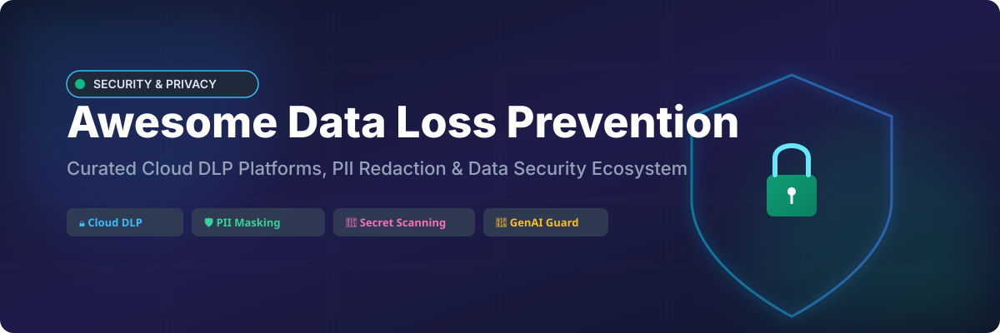
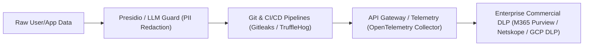

# 🛡️ Awesome Data Loss Prevention (DLP) & Sensitive Data Protection

  

     

---

## 📌 Top Data Loss Prevention (Cloud DLP) Platforms Ecosystem

**Curated List of SaaS Products, Security Tools & Open-Source GitHub Projects**

*Focused on Cloud & Endpoint Data Loss Prevention (DLP), Sensitive Data Discovery, PII Detection & Redaction, Secret Scanning, Policy Enforcement, SaaS/GenAI Protection & Exfiltration Prevention.*

**Last updated: October 2026**

---

### 🔍 Overview

This repository tracks notable **SaaS platforms** and **open-source projects** for **Data Loss Prevention (Cloud DLP)** and **Sensitive Data Protection**. Data Loss Prevention systems discover, classify, monitor, and block sensitive data (such as PII, PHI, PCI-DSS, secrets, and trade secrets) leaving approved channels—across cloud applications, email networks, endpoints, web gateways, and Generative AI (GenAI) prompts.

---

## 🌐 SaaS & Commercial DLP Platforms

### 📊 Market Size & Structure Insights
> **Market Size & Structure:** The global Data Loss Prevention (DLP) market is valued at **~$4.1B – $5.2B in 2026**, growing at a CAGR of ~22%. The market is **moderately fragmented**, comprising enterprise cloud security titans alongside specialized point-solution vendors across cloud security posture, endpoint monitoring, and AI guardrails.

---

### 💳 SaaS Product Comparison

| Product | Description | Enterprise Scale / Market Cap / Revenue | Starting Pricing Tier | Free Tier / Trial Limits |
| :--- | :--- | :--- | :--- | :--- |
| **[Microsoft Purview DLP](https://www.microsoft.com/en-us/security/business/information-protection/microsoft-purview-data-loss-prevention)** | 🛡️ Native Microsoft 365 & cloud DLP with sensitivity labels, endpoint enforcement, and GenAI coverage. | **$3.78 Trillion** Market Cap ($331.8B Rev) | **$36.00/user/month** (Included in M365 E3/E5 or Purview Suite Add-on) | 90-day full-feature enterprise free trial |
| **[Broadcom (Symantec DLP)](https://www.broadcom.com/products/cybersecurity/information-protection)** | 🔒 Established enterprise DLP suite covering endpoint, network, cloud storage, and discovery. | **$1.69 Trillion** Market Cap ($118B Rev) | **~$45.00/user/year** (Enterprise licensing quote starting threshold) | 30-day corporate trial via authorized partners |
| **[Google Cloud DLP](https://cloud.google.com/sensitive-data-protection)** | ☁️ Google Cloud Sensitive Data Protection for discovering, classifying, and de-identifying sensitive data in pipelines. | **$2.45 Trillion** Market Cap (Alphabet, $350B+ Rev) | **$3.00 per GB** scanned (Inspection & Transformation tier) | **$300 free credits** (New accounts) + monthly free tier allowance |
| **[Proofpoint DLP](https://www.proofpoint.com/)** | 📧 Enterprise DLP focused on email, cloud applications, and people-centric threat & data exfiltration protection. | **$12.3 Billion** Valuation ($1.2B Rev) | **~$35.00/user/year** (Starting email & cloud DLP package) | 30-day enterprise evaluation trial |
| **[Netskope DLP](https://www.netskope.com/)** | ⚡ Cloud-native DLP within the Netskope SASE/SSE platform—strong on SaaS apps, web, and GenAI risk control. | **$7.5 Billion** Valuation ($850M Rev) | **~$8.00/user/month** (Base SASE / Cloud Access Security Broker module) | 30-day guided proof-of-concept trial |
| **[Varonis](https://www.varonis.com/)** | 📂 Data security platform with automated data classification, permissions management, and threat detection. | **$5.3 Billion** Market Cap ($688M Rev) | **~$60.00/user/year** (Data Security Platform base subscription) | 30-day free Data Risk Assessment trial |
| **[Forcepoint DLP](https://www.forcepoint.com/product/dlp-data-loss-prevention)** | 🏛️ Hybrid and cloud DLP with user behavior analytics, custom policy controls, and multi-channel coverage. | **$2.45 Billion** Valuation ($650M Rev) | **~$38.00/user/year** (Suite starting tier) | 30-day proof-of-concept trial |
| **[Digital Guardian (Fortra)](https://www.digitalguardian.com/)** | 💻 Data protection and DLP platform emphasizing deep endpoint visibility and kernel-level data movement control. | **~$1.5 Billion** Parent Valuation ($200M+ Rev) | **~$50.00/agent/year** (Endpoint DLP starter edition) | 30-day enterprise trial request |
| **[Trellix DLP](https://www.trellix.com/)** | 🛡️ Data loss prevention suite within the Trellix (McAfee Enterprise + FireEye) security portfolio. | **~$1.2 Billion** Private Est. ($1.1B Rev) | **~$40.00/node/year** (Complete Data Protection tier) | 30-day evaluation license |
| **[GTB Technologies](https://gttb.com/)** | 🔑 Data loss prevention solutions specializing in real-time content inspection and data fingerprinting. | **Self-funded Private** (Global 1000 Vendor) | **~$30.00/user/year** (Standard DLP gateway suite) | 14-day evaluation demo license |

---

## 🔓 Open-Source GitHub Projects

*Open-source building blocks for PII detection, automated redaction, secret scanning, and LLM data guardrails. Star count links lead directly to stargazers.*

| Project | Description | GitHub Stars |
| :--- | :--- | :--- |
| **[gitleaks](https://github.com/zricethezav/gitleaks)** | 🔑 SAST tool for detecting and preventing hardcoded secrets like passwords, API keys, and tokens in git repos. |  |
| **[trufflehog](https://github.com/trufflesecurity/trufflehog)** | 🐽 Finds secrets and credential leaks across git repositories, cloud storage, S3 buckets, and file systems. |  |
| **[opentelemetry-collector](https://github.com/open-telemetry/opentelemetry-collector)** | 📡 Vendor-agnostic telemetry collector with processor capabilities for redacting PII in traces/logs. |  |
| **[presidio](https://github.com/microsoft/presidio)** | 🛡️ Context-aware PII detection, redaction, and anonymization engine for text, images, and structured data pipelines. |  |
| **[SecretScanner](https://github.com/deepfence/SecretScanner)** | 🔍 Scans container images and file systems for sensitive secrets, private keys, and passwords. |  |
| **[llm-guard](https://github.com/protectai/llm-guard)** | 🤖 Security toolkit for LLM applications to sanitize prompts, detect PII leaks, and prevent prompt injection. |  |
| **[whispers](https://github.com/Skyscanner/whispers)** | 🤫 Static code analysis tool designed to parse structured files (YAML, JSON, XML) for hardcoded secrets. |  |
| **[nightfall-go-sdk](https://github.com/nightfallai/nightfall-go-sdk)** | 📦 Go SDK for Nightfall AI's sensitive data discovery and PII detection APIs. |  |

---

### 💡 Architectural Recommendation

*Detect & redact with open-source engines at the application level → scan code repositories with open detectors → enforce comprehensive inline blocking and policy workflows with Enterprise Cloud DLP.*

---

## 🤝 How to Contribute

1. Fork the repository.
2. Add/edit entries in `README.md` following the tabular layout.
3. Include accurate pricing, market metrics, or open-source links.
4. Submit a Pull Request with a descriptive title.

Check out the full list of awesome resources at [Awesome-Awesome-Awesome](https://github.com/ishandutta2007/Awesome-Awesome-Awesome)!

---

## 💖 Support & Acknowledgments

Thank you for visiting and supporting the **Awesome Data Loss Prevention** repository! Your contributions, feedback, and engagement keep this ecosystem up-to-date for data security engineers worldwide.

If you find this project helpful:
- ⭐ **Star** this repository to show your appreciation!
- 🔀 **Fork** it to contribute missing DLP tools or improvements.
- 📢 **Share** it with your security and privacy engineering colleagues.

☕ **Sponsor & Buy Me a Coffee:**  
If you'd like to support the ongoing maintenance of this and other open-source projects, please consider sponsoring:  
👉 **[GitHub Sponsor Dashboard](https://github.com/sponsors/ishandutta2007)**

---

## ⚠️ Disclaimer

- This list is **community-curated** for educational purposes and does not constitute official commercial endorsement or legal/security advice.
- Pricing metrics, valuations, and star counts are updated as of late 2026 and may fluctuate over time.

---

## 📈 Star History

---

Made with ❤️ for security, privacy, and data protection teams worldwide.

